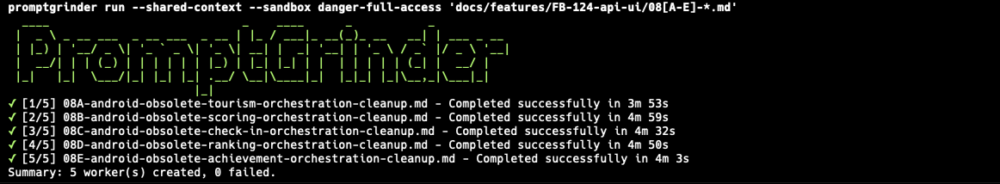

# PromptGrinder — the app that builds itself

**Run AI prompts as deterministic, reviewable engineering workflows.**

## Quick Start

Discover the repository and generate project roles:

    promptgrinder discover

Discovery is deterministic and writes only a new `.promptgrinder/` tree with
`project.yaml`, generated role YAML under `roles/`, and `context/`. It never
overwrites existing files.

Review suggested role improvements without writing them:

    promptgrinder roles enhance

Validate, then run a prompt:

    promptgrinder validate docs/tasks/10-implement.md
    promptgrinder run docs/tasks/10-implement.md

Run an ordered folder in the invoking terminal:

    promptgrinder run-folder docs/tasks/ --detach=false

Resume it after a failure or interruption:

    promptgrinder run-folder docs/tasks/ --detach=false --resume



## Overview

PromptGrinder is a local-first engineering orchestration CLI. It coordinates
replaceable AI runtimes, persistent project-owned workers, deterministic role
discovery, reviewable task queues, and Markdown work orders. PromptGrinder owns
identity, policy, lifecycle, state, worktrees, scheduling, and review evidence;
the selected runtime performs the engineering work.

### Core capabilities

- **Ordered execution:** run numbered work orders in a predictable sequence.
- **Shared context:** continue sequential tasks in one resumed Codex session.
- **Reviewable Git history:** checkpoint successful tasks as focused commits.
- **Worker lifecycle:** inspect status, logs, events, cancellation, and stale runs.
- **Deterministic validation:** resolve and validate work orders before launch.
- **Local-first operation:** keep PromptGrinder orchestration state on your machine.
- **Codex integration:** execute through the locally installed Codex CLI.
- **Persistent workers:** define project roles, assign queued tasks, and retain
  lifecycle and review evidence across attempts.
- **Runtime abstraction:** launch named workers through Codex or Antigravity
  without changing their role definitions.
- **Role discovery and enhancement:** generate deterministic role YAML, then
  review grounded AI-assisted recommendations before applying selected changes.
- **macOS terminals:** use Terminal.app, iTerm2, or headless execution.

## Installation

PromptGrinder `v1.0.0-rc.2.1` supports macOS on Apple silicon and Intel. It
requires Git and an installed, authenticated
[Codex CLI](https://developers.openai.com/codex/cli/).

### Release archive

Download the archive for your Mac from the
[GitHub releases page](https://github.com/PromptGrinder/promptgrinder/releases):

- Apple silicon: `promptgrinder_v1.0.0-rc.2.1_darwin_arm64.tar.gz`
- Intel: `promptgrinder_v1.0.0-rc.2.1_darwin_amd64.tar.gz`

Download `checksums.txt` from the same release, then verify and install. This
example uses the Apple silicon archive:

```sh
grep 'promptgrinder_v1.0.0-rc.2.1_darwin_arm64.tar.gz' checksums.txt |
  shasum -a 256 -c -
tar -xzf promptgrinder_v1.0.0-rc.2.1_darwin_arm64.tar.gz
install -d "$HOME/.local/bin"
install -m 0755 \
  promptgrinder_v1.0.0-rc.2.1_darwin_arm64/promptgrinder \
  "$HOME/.local/bin/promptgrinder"
promptgrinder --version
```

Use the `amd64` archive and directory on Intel. Ensure `$HOME/.local/bin` is on
`PATH`. `promptgrinder doctor` detects the current shell and prints an exact,
copyable PATH command when it is not. It reports the change but never edits
`.zshrc`, `.bash_profile`, or another shell profile automatically. Release
binaries are currently unsigned and not notarized.

### Build from source

The required Go version is pinned in [`go.mod`](go.mod).

```sh
git clone https://github.com/PromptGrinder/promptgrinder.git
cd promptgrinder
go install ./cmd/promptgrinder
promptgrinder --version
```

Homebrew, Linux, Windows, and automatic updates are not supported by this
release candidate.

## Running prompts

The tracked smoke work order reads repository documentation but does not edit
files. Run it from a PromptGrinder checkout:

```sh
promptgrinder --version
promptgrinder doctor --terminal headless
promptgrinder validate examples/smoke/read-only.md
PROMPTGRINDER_TERMINAL_ADAPTER=headless \
  promptgrinder run examples/smoke/read-only.md
promptgrinder list
promptgrinder status <worker-id>
promptgrinder logs <worker-id>
```

Replace `<worker-id>` with the ID printed by `run` or `list`. A successful
worker ends in `succeeded`; `git status --short` should remain unchanged.

For a new work order, copy [`examples/minimal.md`](examples/minimal.md), replace
its objective, and run `promptgrinder validate` before execution.

## Reviewable Git history

Sequential workflows can commit each successful work order separately. This
keeps AI-assisted engineering work aligned with a normal reviewable Git
workflow instead of collecting every change in one commit.

```text
git log --oneline

cc568e36 PromptGrinder: complete 08E-android-obsolete-achievement-orchestration-cleanup.md
b256af84 PromptGrinder: complete 08D-android-obsolete-ranking-orchestration-cleanup.md
55e7e6ab PromptGrinder: complete 08C-android-obsolete-check-in-orchestration-cleanup.md
b8e112d2 PromptGrinder: complete 08B-android-obsolete-scoring-orchestration-cleanup.md
7f8a6dd7 PromptGrinder: complete 08A-android-obsolete-tourism-orchestration-cleanup.md
```

## How PromptGrinder works

1. You describe a bounded engineering task in Markdown.
2. PromptGrinder resolves its repository, metadata, Codex settings, and order.
3. Validation rejects invalid task input before a worker is launched.
4. The worker invokes the local Codex CLI in the selected repository.
5. PromptGrinder records local status, logs, events, and completion summaries.
6. Ordered workflows can pass completion context forward and checkpoint each
   successful task in Git.

`run` accepts independent work orders. `run --shared-context` and `run-folder`
execute sequential work. A failed sequential task stops the sequence.
PromptGrinder does not provide a command that pushes commits, creates pull
requests, publishes releases, or merges branches.

Automatic per-task commits are conservative: `--commit-each=true` requires a
clean Git baseline even if `--require-clean-git=false` is supplied, stages only
the paths attributed to that worker (including deletions), and refuses a commit
when the index, worktree, or HEAD changes unexpectedly. PromptGrinder state and
output paths are never included. Start from a clean worktree and use
`--require-clean-git`; use `--commit-each=false` unless focused automatic
commits are intended.

## Examples

- [`examples/minimal.md`](examples/minimal.md) — the smallest useful work order.
- [`examples/multi-step.md`](examples/multi-step.md) — ordered multi-step work.
- [`examples/shared-context.md`](examples/shared-context.md) — sequential tasks
  that build on prior context in a disposable repository.
- [`examples/smoke/read-only.md`](examples/smoke/read-only.md) — safe read-only
  installation verification.

## Main commands

| Command | Purpose |
| --- | --- |
| `run <path...>` | Run one or more work orders |
| `run-folder <folder>` | Run numbered work orders sequentially |
| `discover` | Detect repository technologies and generate `.promptgrinder/` project roles |
| `roles enhance` | Review grounded role recommendations; apply with `--apply-all` or `--apply-selected <id>` |
| `validate <task.md>` | Validate a work order without creating a worker; add `--render` to print the exact engine prompt |
| `doctor` | Check platform, Codex, Git, configuration, state, and terminal readiness |
| `setup` | Preview or create PromptGrinder-owned first-use files |
| `list` | List workers |
| `status <worker-id>` | Inspect one worker |
| `logs <worker-id>` | Read one worker log |
| `events [worker-id]` | Read or follow worker or global events |
| `sequence <id\|current>` | Inspect an ordered workflow |
| `sequences [--folder <path>]` | List ordered workflows, optionally filtered by a normalized relative or absolute folder path |
| `cancel <worker-id>` | Cancel an active worker |
| `reconcile` | Inspect stale workers and sequences |

Use `promptgrinder --help` and `promptgrinder <command> --help` for the complete
command and option reference. Add `--json` where supported for structured
output.

### Ordered folder completion contract

`run-folder` discovers only recognized numbered Markdown names:
`00-specification*.md`, `NN-implement-*.md`, `NN-test-*.md`,
`NN-verify-*.md`, `NN-final-verify*.md`, and `NN-review-*.md`. README files,
notes, completion reports, and unknown numbered file types are never runnable.
Specifications are shared context unless `--include-specification` is set.

PromptGrinder appends one visible completion-report instruction to every
runnable ordered prompt, including the first prompt, resumed prompts, prompts
using shared specifications, and non-Codex engines. A zero engine exit is only
successful when the final structured result contains exactly one `STATUS:
PASS` and exactly one `NEXT_PROMPT_SAFE: yes`. Missing, malformed, duplicate,
blocked, partial, or unsafe reports stop the sequence and are persisted with
the worker ID, log, engine exit code, completion fields, and semantic reason.
Independent `run` commands retain their existing engine behavior.

Sequence human and JSON output includes UTC created, started, updated, and
finished timestamps; older records without those fields remain readable.
Detached startup prints the sequence ID and a copyable `promptgrinder sequence
<id>` command. Detached completion and failure notifications are deterministic
local events under `PROMPTGRINDER_HOME`; they require no network or GUI access.
Foreground execution stays in the invoking terminal, prints the full prompt
inventory before launch, and shows live status, elapsed time, worker IDs, logs,
and immediate failure reasons. `--plain` keeps the same information without
colors, animation, or terminal control sequences.

For now, task bodies must contain the actual instructions to execute. Custom
YAML fields are not an instruction language and unsupported frontmatter keys
are rejected rather than treated as task content.

`roles enhance` is review-only by default and with `--reject-all`. It writes
nothing unless `--apply-all` or `--apply-selected <id>[,<id>...]` is supplied;
these approval flags are mutually exclusive. Use `--json` for deterministic
automation output. The configured Codex executable is used only through a
bounded, structured advisor request in a temporary directory with a read-only
sandbox. PromptGrinder validates grounding and performs all YAML merging; the
advisor never receives the repository path or write access.

The `.promptgrinder/project.yaml` and `.promptgrinder/roles/*.yaml` files are
discovery and enhancement artifacts in RC.2. Executable named-worker definitions
remain in `.ai/workers.yaml`; RC.2 does not silently convert or activate a
suggested role as a worker.

## Configuration

Configuration precedence, highest first:

1. CLI flags
2. `PROMPTGRINDER_*` environment variables
3. Repository `.ai/config.yaml`
4. User `~/.promptgrinder/config.yaml`
5. User `~/.promptgrinder/templates/default.yaml`
6. Built-in defaults

Inspect resolved settings and their sources:

```sh
promptgrinder defaults
promptgrinder doctor --repo . --json
```

`promptgrinder setup --dry-run` previews first-use writes. `setup` does not
install Codex, authenticate accounts, edit shell profiles, or change macOS
privacy settings.

## Validation and safety model

PromptGrinder provides orchestration controls, not a security guarantee:

- work orders are explicit Markdown files;
- task paths, metadata, repositories, and supported settings are validated;
- ordered work is selected and executed predictably;
- worker state, events, logs, and summaries remain inspectable locally;
- shared-context workflows require Git and a clean worktree by default;
- no hosted PromptGrinder service is required.

### Task frontmatter contract v1

Frontmatter is a strict, versioned contract. Unknown top-level keys and unknown
keys nested under `engine` are errors; YAML anchors/aliases and `depends_on` are
not supported. Errors name the source task. Runtime metadata remains separate
from task instructions:

- `engine` (a name or mapping with `name`, `model`, `profile`, `sandbox`,
  `approval`, `web_search`, and `images`), plus the compatible top-level engine
  keys `sandbox`, `approval`, `web_search`, and `images`;
- `working_directory`, `timeout`, `labels`, and `env` configure execution or
  identify the run;
- `acceptance_criteria` is a nonempty string or nonempty list of strings;
- `allowed_paths` is a nonempty list of repository-relative patterns;
- `forbidden_paths` is a list of repository-relative patterns and may be empty;
- `validation` is a nonempty string or nonempty list of commands or
  instructions.

`allowed_paths` and `forbidden_paths` are enforced for ordinary `run` and
`run-folder` workers as well as named workers. Forbidden patterns win. Keep
executable instructions in the Markdown body and use only supported metadata.

The four semantic fields are rendered, in the order shown above, into a
`# Task Semantics (v1)` preamble sent to the engine. The Markdown body following
frontmatter is otherwise byte-for-byte unchanged. Validation entries are AI
instructions only: PromptGrinder never executes them as shell commands.
Absolute or repository-escaping path patterns, identical allowed/forbidden
rules, empty required values, wrong types, and secret-looking semantic values
are rejected. A deterministic warning is emitted when frontmatter is at least
2048 bytes, rendered task instructions are at most 256 bytes, and frontmatter
is at least eight times larger; warnings appear in human and JSON validation.

Use `promptgrinder validate --render <task.md>` to inspect the exact prompt
bytes without launching Codex or creating worker state. `--render` and `--json`
are intentionally incompatible; ordinary `--json` validation reports the
warning and execution plan fields.

PromptGrinder passes the selected sandbox and approval settings to Codex; Codex
performs model execution and tool use. Review work orders and permissions before
running them. Arbitrary AI-generated commands are not inherently safe.

PromptGrinder stores state under
`${PROMPTGRINDER_HOME:-$HOME/.promptgrinder}` and sends no PromptGrinder product
telemetry. Task content is handled by Codex under its own configuration and
terms. See [`SECURITY.md`](SECURITY.md) and [`SUPPORT.md`](SUPPORT.md).

### Named-worker runtimes

Named workers are persistent project roles, separate from the one-off execution
records shown by the top-level `list` and `status` commands. A repository opts
in by adding `.ai/workers.yaml`:

```yaml
version: 1
project:
  id: example
  name: Example
  require_separate_reviewer: true

workers:
  backend-sonar:
    display_name: Backend Sonar Engineer
    role: Resolve backend static-analysis findings safely.
    runtime: codex
    branch:
      prefix: worker/backend-sonar
    worktree:
      default: .
      require_clean: true
    paths:
      allowed:
        - backend/**
        - tasks/**
      forbidden:
        - infrastructure/production/**

  reviewer:
    display_name: Reviewer
    role: Review completed worker tasks.
    runtime: codex
    branch:
      prefix: worker/reviewer
    worktree:
      default: .
    paths:
      allowed:
        - "**"
      forbidden:
        - infrastructure/production/**
```

Worker definitions contain reviewable identity and policy only. PromptGrinder
stores assignments, queue entries, attempts, lifecycle state, runtime
references, and review evidence beneath
`${PROMPTGRINDER_HOME:-$HOME/.promptgrinder}/projects/<project-id>/`.
Run these commands anywhere inside the configured Git repository:

```sh
promptgrinder worker list
promptgrinder worker show backend-sonar
promptgrinder worker start backend-sonar --dry-run

promptgrinder task assign backend-sonar tasks/sonar-001.md
promptgrinder worker start backend-sonar
promptgrinder worker status backend-sonar
```

`task assign` makes the task active when the worker is idle; later assignments
join its FIFO queue. `task enqueue` always queues. Inspect and control queued
work with `task list`, `task queue list`, `task queue reorder`, and
`task queue remove`. `scheduler run --once` dispatches at most one eligible
idle worker; omit `--once` to run the local scheduler loop. Project and runtime
limits can be set in `.ai/config.yaml`:

```yaml
scheduler:
  project_concurrency: 2
  runtime_concurrency:
    codex: 2
    antigravity: 1
  lease_ttl: 1m
```

Use `worker pause`, `worker resume`, `task retry`, and `task cancel` for local
control. Attempts and control evidence are retained. Submit completed evidence
with `review submit`, then use `review show`, `review accept`, or
`review reject`; these commands do not push, merge, publish, or otherwise
perform external Git operations. See [`docs/worker-controls.md`](docs/worker-controls.md)
for stop and resume semantics.

Path policy is checked against changes attributed to the worker. Forbidden
rules override allowed rules, and violating changes are retained for human
review rather than reverted. This orchestration policy complements, but does
not replace, the runtime sandbox.

Named workers select a runtime by symbolic key in `.ai/workers.yaml`.
PromptGrinder currently registers `codex` and `antigravity` for named-worker
launches. Existing `run` and `run-folder` workflows continue to use the Codex
engine.

Antigravity uses its documented non-interactive JSON mode. Install `agy`
separately and either place it on `PATH` or configure its executable:

```yaml
runtime:
  antigravity:
    executable: /Users/example/.local/bin/agy
    sandbox: true
    mode: accept-edits
    required_capabilities:
      headless: true
      structured_output: true
      working_directory: true
```

Supported Antigravity options are `executable`, `model`, `agent`, `effort`,
`mode`, `sandbox`, `print_timeout`, and
`dangerously_skip_permissions`. PromptGrinder does not advertise Antigravity
session resume because the CLI does not currently document a conversation ID
in headless results; resume therefore starts a new retained task attempt.
All named-worker launches require headless operation, structured output, and
working-directory selection by default. A runtime may additionally require
`interactive`, `session_resume`, `sandbox`, `approval`, or `environment` under
its namespaced `required_capabilities` mapping; PromptGrinder rejects a missing
capability before adapter preflight or process launch.

## Platform support

The `v1.0.0-rc.2.1` release candidate targets macOS on Apple silicon and Intel
and includes the orchestration capabilities documented above:

- macOS on Apple silicon (`darwin/arm64`);
- macOS on Intel (`darwin/amd64`);
- Codex for one-off `run` and `run-folder` execution;
- Codex and Antigravity adapters for named-worker execution;
- Terminal.app, iTerm2, and headless execution.

Exact qualified macOS, Codex, Terminal.app, and iTerm2 versions remain pending
clean-machine qualification. Linux and Windows may be technically compilable
in part, but they are untested and unsupported for this release candidate.
Source builds require the Go version declared in [`go.mod`](go.mod).

## Development

```sh
go test ./...
go test -race ./...
go vet ./...
test -z "$(gofmt -l .)"
```

Ordinary tests do not open terminal applications. Compile the live macOS
integration tests without running them:

```sh
go test -tags=integration -run '^$' ./internal/terminal
```

Run them intentionally with:

```sh
PROMPTGRINDER_LIVE_TERMINAL=1 \
  go test -tags=integration ./internal/terminal
```

This may open Terminal.app and iTerm2 and trigger macOS Automation prompts.
See [`CONTRIBUTING.md`](CONTRIBUTING.md) before submitting a change.
Repository-local Codex development skills live under `.agents/skills/` for
general development, slice authoring, CI, and release qualification.

## Documentation and support

- [`docs/use-cases.md`](docs/use-cases.md) — canonical catalog of supported
  PromptGrinder workflows and product boundaries.

- [Release policy](docs/RELEASE_POLICY.md)
- [RC.2.1 qualification](docs/release/v1.0.0-rc.2.1-qualification.md)
- [RC.2.1 final gate](docs/release/v1.0.0-rc.2.1-final-gate.md)
- [RC.2.1 candidate notes](docs/release/v1.0.0-rc.2.1-release-notes.md)
- [Historical RC.2 notes](docs/release/v1.0.0-rc.2-release-notes.md)
- [Historical RC.1 qualification](docs/release/qualification.md)
- [Historical RC.1 notes](docs/release/v1.0.0-rc.1-release-notes.md)
- [Support](SUPPORT.md)
- [Security policy](SECURITY.md)
- [Contributing](CONTRIBUTING.md)

PromptGrinder was created and is maintained by
[Andreas Nyberg](AUTHORS.md).

## License

PromptGrinder is available under the [MIT License](LICENSE).
